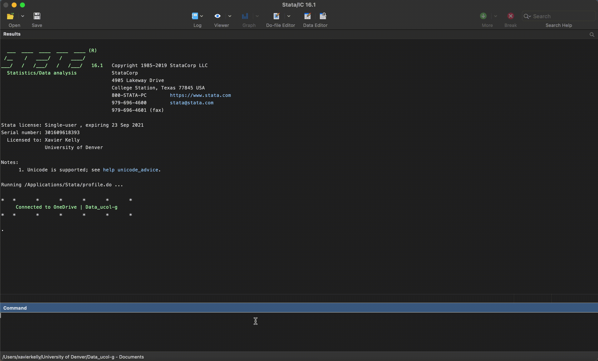

<center></center>

# 🛠☁️ Stata OneDrive Toolkit | UCOL


## Description

This toolkit is intended to ease data management on the OneDrive Ucol_data-g shared library for the University of Denver.

### Sharepoint Link
https://denveru.sharepoint.com/sites/Data_ucol-g
**Note**: Must have access to Data_ucol-g (contact details below)

## Requirements

The following requirements need to be met:	<br />
1. STATA (version 12 or later)	<br />
2. OneDrive Data_ucol-g synced at the following location on your device:
   - For MacOSX users: /Users/**user**/University of Denver/Data_ucol-g - Documents
   - Windows users: C:\Users\ **user**\OneDrive - University of Denver\Shared Documents	

## OneDrive Structure

```
.
├── ...					
├── Data_ucol-g					
│   ├── other            			
│   └── repository				           
│   	├── code (toolkit folder) 	       
│   	├── main_data				
|	├── output				
│   	└── reports				
	
```

## Linking STATA and the repository

In order to run the process and open the dialog box, run the linkOneDrive.do file found 
in the code folder (see above). Make sure the "connected to OneDrive" icon appears in
command log - if this doesn't work, the shared library is most likely not in the correct
path. See 2. in the **Requirements** section

To open the user interface (dialog box), type "ucol open"

### Auto link on startup

If you'd like to avoid having to run linkOneDrive.do every time you start STATA, complete
the following steps.
1. MAKE A COPY of linkOneDrive.do file (found in repository/code)
2. Rename the file profile.do
3. Depending on operating system, go to the following path:
   - Mac: /Applications/Stata <br />
   - Windows: C:\ProgramFiles\Stata16 | (Note: the path will change according to Stata version (e.g Sata14))
4. Drop the profile.do file, and if you have STATA open, restart it
5. On startup, you should be able to see the "connected to OneDrive" icon in the command log

## Commands
List of commands will be uploaded shortly

## Example


## Contact
Feel free to reach out at xavier.kelly@du.edu
