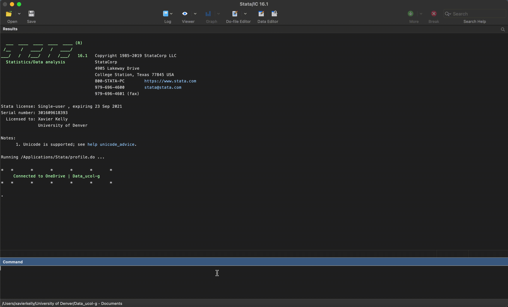

<p align="center"></p>

# Stata OneDrive Toolkit

## Description

This toolkit is intended to ease data management on the OneDrive ```ucol_data``` shared library for the University of Denver.

### Sharepoint Link
[ucol_data-g](https://denveru.sharepoint.com/sites/Data_ucol-g)
> Note: Must have access to ```ucol_data``` (contact details below)

## Requirements

The following requirements need to be met:	<br />
1. Stata/IC, Stata/SE or Stata/MP (version 12 or later)	<br />
2. OneDrive ```ucol_data``` synced at the following location on your device:
   - For MacOSX users: ```/Users/john_doe/University of Denver/ucol_data-g - Documents```
   - Windows users: ```C:\Users\john_doe\OneDrive - University of Denver\Shared Documents```

## OneDrive Structure

```
.
├── ...					
├── ucol_data-g					
│   ├── other            			
│   └── repository				           
│   	├── code (SOD-TK folder) 	       
│   	├── main_data				
|	├── output				
│   	└── reports				
	
```

## Link Stata and ```ucol_data```

In order to run the process and open the dialog box, run the ```linkOneDrive.do``` file  
in the code folder ```/repository/code```.

A message "connected to OneDrive" should appear in
command log - if this doesn't work, the shared library is most likely not in the correct
path. See ```Requirements -> 2.``` 

> Note: to open the user interface (dialog box), type "ucol open"


## Commands
| Command        | Description   |
| -------------  | ------------- |
| ```ucol```     | main tools    |
| ```navigate``` | move around   |
| ```goodbye```  | leave         |

## Example


## Contact
xavier.kelly@du.edu
